# DACH Data Job Market Analysis

## Overview

This project is part of my public [Data Analysis Project repository](https://github.com/fallerdavid98-ai/Data_Analysis_Project/tree/main) and analyzes the demand for technical skills in data-related job postings across the DACH region. For this analysis, the region includes **Germany, Austria, Switzerland, and Luxembourg**.

The project began with the 2023 job-posting dataset provided through [Luke Barousse's Python course](https://lukebarousse.com/python) and has since been extended with a global data export containing records into 2026. It starts with an exploratory overview of the DACH job market and then analyzes role-specific skill demand, monthly skill trends, salary distributions, and the relationship between skill prominence and median salary.

To maintain comparability, **2023 remains the baseline year** and **January through November 2025 is used as the most recent DACH comparison period** for the EDA, skill-demand, skill-trend, and optimal-skill visualizations. The original 2023 charts are retained alongside the new 2025 results. Salary-distribution boxplots are the only exception: because individual recent periods contain too few reported annual salaries, the updated distribution pools all available DACH salary observations rather than being interpreted as a before-and-after comparison.

> [!IMPORTANT]
> **Different maximum dates:** The complete global export extends into 2026, but the DACH subset contains records only through **November 2025**. Consequently, the updated DACH charts contain no 2026 observations, and the 2025 comparison does not include December.

All five project notebooks are included in the documented analytical workflow.

## Project Navigation

- [Repository home](https://github.com/fallerdavid98-ai/Data_Analysis_Project/tree/main)
- [Advanced Python and Pandas exercises](2_Advanced/)
- [Project notebooks](3_Project/)
- [Exploratory Data Analysis notebook](3_Project/1_EDA_Intro.ipynb)
- [DACH Skill Demand notebook](3_Project/2_Skill_Demand.ipynb)
- [DACH Skill Trends notebook](3_Project/3_Skills_Trend.ipynb)
- [DACH Salary Analysis notebook](3_Project/4_Salary_Analysis.ipynb)
- [DACH Optimal Skills notebook](3_Project/5_Optimal_Skills.ipynb)

## Project Status

| Analysis question | Status |
|---|---|
| 0. What does the DACH data-job landscape look like? | ✅ Completed |
| 1. Which skills are most in demand for the selected data roles? | ✅ Completed |
| 2. How are the leading skills trending across DACH data jobs? | ✅ Completed |
| 3. How well do data roles and skills pay? | ✅ Completed |
| 4. Which skills offer the best combination of prominence and salary? | ✅ Completed |

## The Questions

This project is designed to answer the following questions:

1. Which skills are most in demand for Data Analysts, Data Engineers, and Data Scientists in the DACH region?
2. How are the leading skills trending across DACH data jobs?
3. How well do data jobs and individual skills pay in the DACH region?
4. Which skills offer the strongest balance between prominence and median salary?

## Tools Used

- **Python:** Core programming language for the analysis.
  - **Pandas:** Data cleaning, filtering, reshaping, grouping, and aggregation.
  - **Matplotlib:** Figure creation and detailed plot formatting.
  - **Seaborn:** Statistical data visualization.
- **Jupyter Notebook:** Interactive development and documentation of the analytical workflow.
- **Visual Studio Code:** Development environment used to work with the notebook and project files.
- **Git and GitHub:** Version control and project publication.

## Data Preparation and Cleanup

### Import and clean the dataset

The original 2023 analysis loads the course dataset through Hugging Face. The updated notebooks use a newer global CSV export containing records into 2026; after filtering to the DACH countries, the latest available observation is from November 2025. In both cases, date values are converted to a datetime data type and serialized skill lists are converted into Python lists.

```python
import ast
import pandas as pd
from datasets import load_dataset
import matplotlib.pyplot as plt
from matplotlib.ticker import StrMethodFormatter, PercentFormatter
import seaborn as sns

dataset = load_dataset("lukebarousse/data_jobs")
df = dataset["train"].to_pandas()

df["job_posted_date"] = pd.to_datetime(df["job_posted_date"])
df["job_skills"] = df["job_skills"].apply(
    lambda x: ast.literal_eval(x) if pd.notna(x) else x
)
```

The updated notebooks load the current export locally:

```python
df = pd.read_csv("Exporte/job_postings_flat.csv")

df["job_posted_date"] = pd.to_datetime(df["job_posted_date"])
df["job_skills"] = df["job_skills"].apply(
    lambda x: ast.literal_eval(x) if pd.notna(x) else x
)
```

> [!NOTE]
> The `Exporte/` directory is excluded from version control. To rerun the updated notebooks, the current CSV export must be supplied locally and its path adjusted to the local project structure.

### Select comparable periods

The updated year-specific analyses select 2025 because the DACH subset contains no 2026 observations:

```python
df_2025 = df[df["job_posted_date"].dt.year == 2025]
```

The salary-distribution analysis deliberately omits this year filter and uses the complete available DACH period from 2023 through November 2025. The revised image filename and plot title now refer to `2023 to 2025`; more precisely, the effective DACH observation window ends in November 2025.

### Filter the DACH region

The analysis is restricted to job postings from Germany, Austria, Switzerland, and Luxembourg.

```python
DACH_countries = ["Germany", "Austria", "Switzerland", "Luxembourg"]

df_DACH = df[df["job_country"].isin(DACH_countries)].copy()
```

### Prepare the skill data

Each job posting can contain multiple skills. The `explode()` operation creates one row per listed skill, allowing skill occurrences to be counted by job title.

```python
df_DACH_expl = df_DACH.explode("job_skills")

df_DACH_skillcount = (
    df_DACH_expl
    .groupby(["job_skills", "job_title_short"])
    .size()
    .reset_index(name="skill_count")
)

df_DACH_skillcount.sort_values(
    by="skill_count",
    ascending=False,
    inplace=True
)

job_titles = df_DACH_skillcount["job_title_short"].unique().tolist()
job_titles = sorted(job_titles[:3])
```

Related learning notebooks used to build these preparation steps:

- [Pandas Data Cleaning](2_Advanced/2_Pandas_Data_cleaning.ipynb)
- [Pandas Data Management](2_Advanced/3_Pandas_Data_Management.ipynb)
- [Pandas Merge DataFrames](2_Advanced/7_Pandas_Merge_DataFrames.ipynb)

## Exploratory Data Analysis

View the complete introductory analysis and executable code in the [DACH Exploratory Data Analysis notebook](3_Project/1_EDA_Intro.ipynb).

The exploratory step establishes the regional context before the project moves into skill and salary analysis. It examines where DACH data jobs are advertised, which employment-related attributes are recorded, and which companies appear most frequently in the dataset.

### Leading job-location labels

The postings are grouped by `job_location`, counted, and sorted to identify the 15 most frequent location labels.

```python
df_DACH_plot = (
    df_DACH
    .groupby("job_location")
    .size()
    .sort_values(ascending=False)
    .head(15)
    .to_frame(name="count")
)
```

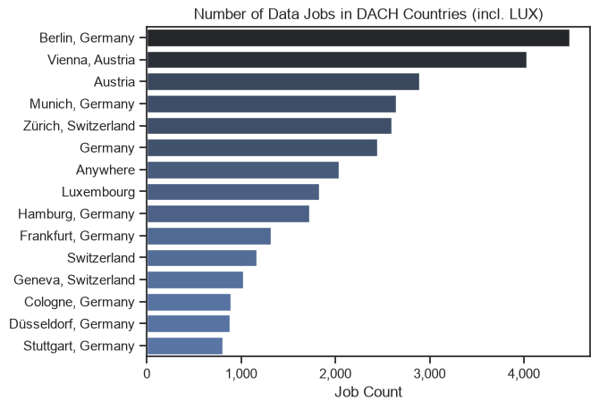

*The 15 most frequently recorded location labels for DACH data-job postings.*

#### Insights

- **Berlin and Vienna lead the ranking:** Berlin records the highest number of postings, followed by Vienna. Munich and Zürich are also among the strongest city-level locations.
- **Austria appears both as a country and through individual cities:** Country-level labels such as `Austria`, `Germany`, and `Switzerland` coexist with city-level entries.
- **Remote or non-specific locations form a separate category:** `Anywhere` is one of the most frequent labels, but it should not be interpreted as a physical DACH location.
- **The ranking mixes different geographical grains:** Cities, countries, and remote-location labels are compared in the same chart. It is therefore a useful overview of the raw location field, not a clean city-only market ranking.

#### 2025 comparison

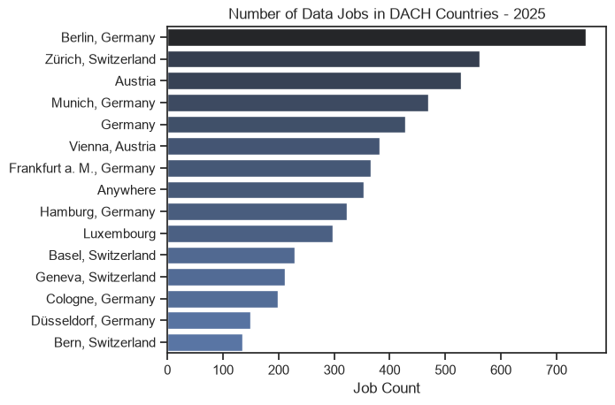

*The same location ranking calculated from the 2025 comparison year.*

- **Berlin remains the leading city-level location:** It retains first place in both periods.
- **Zürich gains prominence:** Zürich moves from behind Vienna and Munich in the 2023 baseline to second place in 2025, while Vienna moves down to sixth.
- **Frankfurt labels are consolidated in 2025:** Entries containing `Frankfurt` are standardized as `Frankfurt a. M., Germany`, improving comparability within the updated year.
- **The mixed-grain limitation remains:** Country labels and `Anywhere` still appear alongside cities.
- **Absolute posting counts are much lower in the 2025 extract:** This may reflect changes in source coverage, collection volume, or the underlying market. The chart alone cannot attribute the difference to a market contraction.

### Work-from-home, degree, and health-insurance indicators

Three Boolean fields provide an initial view of selected characteristics recorded for DACH postings:

```python
eda_columns = [
    "job_work_from_home",
    "job_no_degree_mention",
    "job_health_insurance"
]

for column in eda_columns:
    print(df_DACH[column].value_counts(normalize=True) * 100)
```

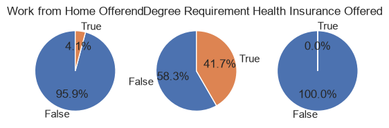

*Shares of the Boolean work-from-home, no-degree-mention, and health-insurance fields in the DACH subset.*

#### Insights

- **Explicit work-from-home offers are uncommon:** Only **4.1%** of postings are marked `True` for `job_work_from_home`. This reflects the dataset flag and may not capture every hybrid-working arrangement described in the original vacancy text.
- **No degree is mentioned in a substantial minority of postings:** `job_no_degree_mention` is `True` for **41.7%** of the DACH subset. Because the column describes the absence of a degree mention, `True` must not be interpreted as a degree requirement.
- **The health-insurance field is not informative for this regional analysis:** Every DACH observation is marked `False`. This should not be read as evidence that DACH employers provide no health coverage; the field is atypical for the European context and likely reflects the source schema rather than actual benefit availability.

#### 2025 comparison

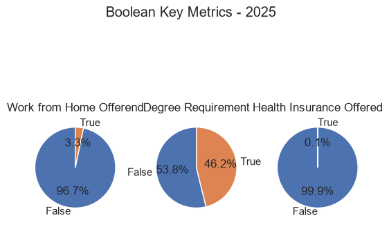

*The same three Boolean indicators calculated from the 2025 comparison year.*

- **The explicit work-from-home share decreases slightly:** It moves from **4.1%** in 2023 to **3.3%** in 2025, a decline of **0.8 percentage points**.
- **Postings without a degree mention become somewhat more common:** The `True` share for `job_no_degree_mention` rises from **41.7%** to **46.2%**, an increase of **4.5 percentage points**.
- **Health insurance remains analytically uninformative:** The `True` share changes from **0.0%** to only **0.1%** and still should not be interpreted as actual DACH benefit coverage.

### Companies with the most postings

Before counting employers, different Deutsche-Bahn labels are consolidated into one company name. The 15 companies with the most DACH postings are then selected.

```python
df_DACH.loc[
    df_DACH["company_name"].str.contains(
        "Deutsche Bahn",
        na=False,
        regex=False
    ),
    "company_name"
] = "Deutsche Bahn"

df_DACH_plot2 = (
    df_DACH
    .groupby("company_name")
    .size()
    .sort_values(ascending=False)
    .head(15)
    .to_frame(name="count")
)
```

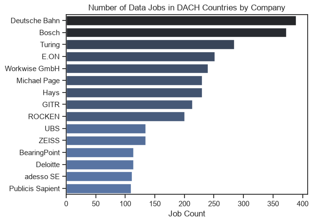

*The 15 company labels with the most data-job postings in the DACH subset.*

#### Insights

- **Deutsche Bahn is the leading employer in the dataset:** After consolidating its naming variants, it records the highest number of DACH postings by a clear margin.
- **Turing ranks second:** Workwise GmbH, Michael Page, Hays, GITR, and ROCKEN form the next group of frequently represented companies.
- **Company-name standardization affects the ranking:** `Bosch Group` and `Bosch Gruppe` still appear as separate labels. A broader entity-resolution step could combine further aliases and change individual positions in the employer ranking.

#### 2025 comparison

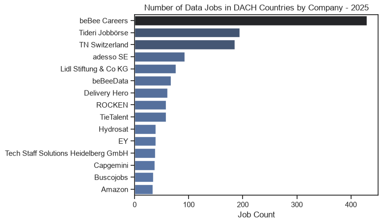

*The 15 company labels with the most DACH data-job postings in 2025.*

- **The composition changes substantially:** Deutsche Bahn, Turing, Workwise, Michael Page, and Hays no longer lead the ranking. `beBee Careers`, `Tideri Jobbörse`, and `TN Switzerland` occupy the top three positions in 2025.
- **Recruiting and aggregation platforms become more visible:** Several leading 2025 labels appear to represent job boards, aggregators, or recruitment platforms rather than only direct employers. The change may therefore partly reflect how postings were collected and attributed.
- **adesso SE and Lidl enter the leading group:** They are among the most frequently represented direct-employer labels in the updated year.
- **Rocken remains present but moves down the ranking:** Its naming variants are consolidated in the 2025 preparation step.
- **The comparison should not be interpreted as pure employer-market turnover:** Changes in data sources and company attribution can materially alter this chart even when the underlying labor market changes less dramatically.

## The Analysis

## 1. Which skills are most in demand for the selected data roles?

View the complete analysis and executable code in the [DACH Skill Demand notebook](3_Project/2_Skill_Demand.ipynb).

### Method

For every combination of job title and skill, the analysis counts how many job postings mention that skill. The count is then divided by the **total number of original job postings for the respective job title**.

The resulting percentage answers questions such as:

> What percentage of all DACH Data Engineer postings mention Python?

Because one posting can request several skills, the percentages of all skills within a role are not expected to sum to 100%.

```python
df_DACH_totaljobs = (
    df_DACH["job_title_short"]
    .value_counts(ascending=False)
    .reset_index(name="total_skill_count")
)

df_DACH_skilljob_merge = df_DACH_skillcount.merge(
    right=df_DACH_totaljobs,
    how="left",
    on="job_title_short"
)

df_DACH_skilljob_merge["skill_share"] = 100 * (
    df_DACH_skilljob_merge["skill_count"]
    / df_DACH_skilljob_merge["total_skill_count"]
)
```

> **Note:** Despite its name in the notebook, `total_skill_count` contains the number of original job postings per job title and is therefore the denominator for the posting-level percentage.

### Visualize the results

The final chart displays the five most frequently requested skills for each selected data role.

The subplot implementation builds on the techniques practiced in the [Subplots exercise notebook](2_Advanced/11_Exercise_Subplots.ipynb).

```python
fig, ax = plt.subplots(len(job_titles), 1)

sns.set_theme(style="ticks")

for i, title in enumerate(job_titles):
    df_DACH_skilljob_plot = df_DACH_skilljob_merge[
        df_DACH_skilljob_merge["job_title_short"] == title
    ].head(5)

    sns.barplot(
        data=df_DACH_skilljob_plot,
        x="skill_share",
        y="job_skills",
        ax=ax[i],
        hue="skill_count",
        palette="dark:b_r"
    )

    ax[i].set_title(title)
    ax[i].set_xlabel("")
    ax[i].set_ylabel("")
    ax[i].legend().set_visible(False)
    ax[i].set_xlim(0, 70)

    if i != len(job_titles) - 1:
        ax[i].set_xticks([])

    for j, value in enumerate(df_DACH_skilljob_plot["skill_share"]):
        ax[i].text(value + 0.5, j, f"{value:.0f}%", va="center")
        ax[i].xaxis.set_major_formatter(
            plt.FuncFormatter(lambda x, _: f"{int(x)}%")
        )

fig.suptitle(
    "Likelihood of Skills Requested in DACH job postings",
    fontsize=15
)
fig.tight_layout()
plt.show()
```

### Results

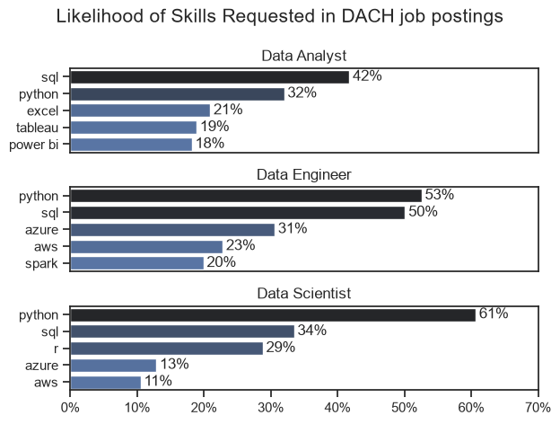

*2023 baseline: percentage of DACH job postings that mention each of the five most frequently requested skills for Data Analysts, Data Engineers, and Data Scientists.*

### Insights

- **Data Analysts:** SQL is the leading skill and appears in **42%** of postings, followed by Python at **32%**. Excel, Tableau, and Power BI form a second group with demand between **18% and 21%**.
- **Data Engineers:** Python and SQL dominate at **53%** and **50%**. Cloud and distributed-processing skills are also prominent: Azure appears in **31%**, AWS in **23%**, and Spark in **20%** of postings.
- **Data Scientists:** Python is the clearest leading skill at **61%**. SQL follows at **34%**, while R remains important at **29%**. Azure and AWS appear less frequently, at **13%** and **11%**.
- **Across roles:** Python and SQL are the only skills represented among the top five for all three roles, demonstrating their broad relevance across the DACH data job market.

### 2025 comparison

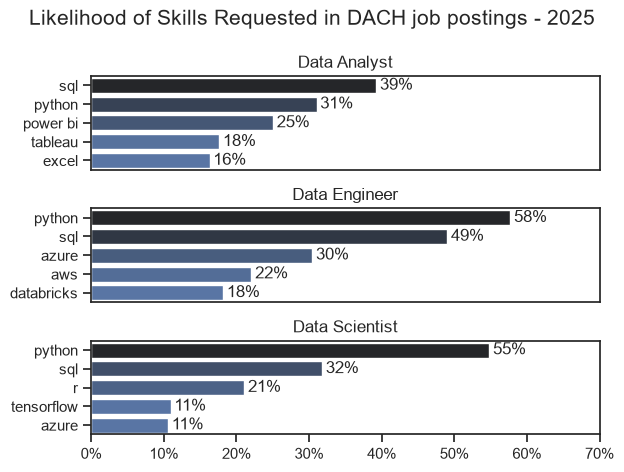

*2025 comparison: posting-level skill shares for the same three role groups.*

- **Data Analysts:** SQL remains first but decreases from **42%** to **39%**, while Python is almost stable at **31%**. Power BI rises from **18%** to **25%** and becomes the third-ranked skill. Excel falls from **21%** to **16%**, while Tableau remains broadly stable at **18%**.
- **Data Engineers:** Python strengthens from **53%** to **58%** and increases its lead over SQL, which remains nearly stable at **49%**. Azure and AWS also remain close to their 2023 levels. Databricks enters the top five at **18%**, replacing Spark.
- **Data Scientists:** Python remains dominant but decreases from **61%** to **55%**. SQL changes only slightly, while R drops more clearly from **29%** to **21%**. TensorFlow enters the top five at **11%**, while AWS is no longer represented there.
- **Cross-role continuity remains high:** Python and SQL are still the only skills appearing among the top five for all three roles.
- **The largest visible structural shifts are role-specific:** Reporting demand becomes more Power-BI-oriented for analysts, Databricks gains visibility in engineering, and the Data Scientist top five shifts from AWS toward TensorFlow.

## 2. How are the leading skills trending across DACH data jobs?

View the complete analysis and executable code in the [DACH Skill Trends notebook](3_Project/3_Skills_Trend.ipynb).

### Method

The monthly trend analysis uses all DACH job postings in the dataset rather than filtering for a single job title. First, every posting receives a numerical month value and its skill list is expanded into individual rows. A pivot table then counts how often each skill appears in each month.

```python
df_DACH["job_posted_month"] = df_DACH["job_posted_date"].dt.month

df_DACH_expl = df_DACH.explode(column="job_skills")

df_DACH_pivot = df_DACH_expl.pivot_table(
    index="job_posted_month",
    columns="job_skills",
    aggfunc="size",
    fill_value=0
)
```

The skills are ranked by their total number of mentions across the selected analysis period. The temporary `total` row is used only for sorting and is removed before calculating the monthly percentages. This ensures that the chart follows the same five leading skills throughout the displayed months instead of changing the selection from month to month.

```python
df_DACH_pivot.loc["total"] = df_DACH_pivot.sum()

df_DACH_pivot = df_DACH_pivot[
    df_DACH_pivot.loc["total"].sort_values(ascending=False).index
]

df_DACH_pivot.drop(index="total", inplace=True)
```

Raw monthly skill counts are normalized by the total number of DACH job postings in the respective month. The resulting value therefore represents the percentage of that month's postings that mention a skill.

```python
DACH_countbymonth = df_DACH.groupby("job_posted_month").size()

df_DACH_perc = df_DACH_pivot.div(
    DACH_countbymonth / 100,
    axis=0
)
```

For example, a Python value of 50% means that Python appears in approximately half of all DACH postings published in that month. Since one posting can mention several skills, the percentages shown for different skills are not intended to add up to 100%.

### Format and visualize the results

The numerical month values are converted into abbreviated month names before the five leading skills are plotted as continuous monthly trends.

```python
df_DACH_perc.reset_index(names="jobs_by_month", inplace=True)

df_DACH_perc["job_posted_month"] = df_DACH_perc["jobs_by_month"].apply(
    lambda x: pd.to_datetime(x, format="%m").strftime("%b")
)

df_DACH_perc.set_index("job_posted_month", inplace=True)
df_DACH_perc.drop(columns="jobs_by_month", inplace=True)

df_DACH_plot = df_DACH_perc.iloc[:, :5]

sns.lineplot(data=df_DACH_plot, dashes=False, palette="tab10")
sns.set_theme(style="ticks")

plt.title("Top 5 Job Skills for DACH Data Jobs (by Month)")
plt.ylabel("Prominence in Job Postings")
plt.xlabel("2023")
plt.legend().remove()
sns.despine()

for i in range(5):
    plt.text(
        11.3,
        df_DACH_plot.iloc[-1, i],
        df_DACH_plot.columns[i]
    )

ax = plt.gca()
ax.yaxis.set_major_formatter(PercentFormatter(decimals=0))

plt.show()
```

The workflow builds on the monthly aggregation techniques practiced in the [Trending Skills exercise notebook](2_Advanced/10_Exercise_Trending_Skills.ipynb).

### Results

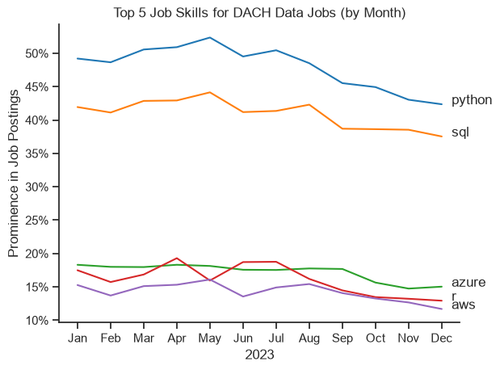

*2023 baseline: monthly share of DACH job postings mentioning each of the five most frequently requested skills.*

### Insights

- **Python and SQL remain dominant:** Both skills lead throughout the year by a wide margin. Python stays above SQL in every month.
- **Demand softens in the second half of the year:** Python peaks at roughly **52%** of monthly postings in May and ends the year at about **42%**. SQL follows a similar pattern, falling from a May peak of approximately **44%** to around **37%** in December.
- **Azure is comparatively stable:** Azure remains close to **18%** for much of the year before declining to roughly **15%** during the fourth quarter.
- **R fluctuates more strongly:** R reaches local highs of around **19%** in April and early summer, but its monthly share falls to approximately **13%** by December.
- **AWS also declines toward year-end:** AWS generally stays in the mid-teen range during the first eight months and finishes the year at roughly **12%**.
- **The annual leaders remain consistent:** Although their monthly prominence changes, Python, SQL, Azure, R, and AWS form the five most frequently mentioned skills across the complete DACH dataset for 2023.

### 2025 comparison

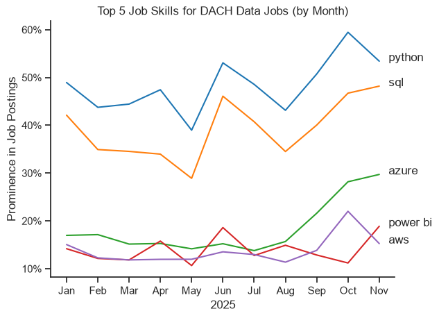

*2025 comparison: normalized monthly skill shares for the five leading skills. The current notebook output contains January through November; no December point is displayed.*

- **Python and SQL remain the clear leaders:** Both retain the top two positions throughout the available 2025 months, but fluctuate more strongly than in 2023.
- **Python reaches its highest level in October:** Its share rises to almost **60%** before ending the displayed period at roughly **54%** in November.
- **SQL recovers strongly after May:** It falls below **30%** in May, then rises to approximately **48%** by November.
- **Azure shows the clearest upward movement:** After remaining near the mid-teens through August, it climbs sharply and approaches **30%** in November. This contrasts with the late-2023 decline visible in the baseline chart.
- **Power BI replaces R in the annual top five:** Its monthly share is volatile and increases markedly in November, reinforcing the role-level shift already visible for Data Analysts.
- **AWS spikes temporarily:** It reaches roughly **22%** in October before falling back in November.
- **The time-window difference must remain visible:** The 2023 chart includes December, while the current 2025 chart stops in November. Year-end comparisons should therefore focus on the available common months or treat November as the endpoint for 2025.

## 3. How well do jobs and skills pay?

View the complete analysis and executable code in the [DACH Salary Analysis notebook](3_Project/4_Salary_Analysis.ipynb).

The salary analysis consists of two parts. The first compares the salary distributions of the six most frequently represented DACH data roles in the salary subset. The second contrasts the skills with the highest median salaries against the skills mentioned most frequently in salary-reported postings.

> [!CAUTION]
> **Limited salary coverage:** Both parts use only postings that contain a value for `salary_year_avg`. Salary information is available for a comparatively small number of DACH postings, so the results should be interpreted as descriptive findings for the available sample rather than precise estimates for the entire DACH job market.

### 3.1 Salary distributions of the six leading data roles

#### Method

The DACH dataset is filtered to postings with a reported annual salary. The six most frequent job titles are then selected from this reduced subset and ordered by median salary.

```python
DACH_countries = ["Germany", "Austria", "Switzerland", "Luxembourg"]

df_DACH = (
    df[df["job_country"].isin(DACH_countries)]
    .dropna(subset=["salary_year_avg"])
    .copy()
)

job_titles = (
    df_DACH["job_title_short"]
    .value_counts()
    .index[:6]
    .unique()
    .tolist()
)

df_DACH_top6 = df_DACH[
    df_DACH["job_title_short"].isin(job_titles)
]

jobs_orderedby_median = (
    df_DACH_top6
    .groupby("job_title_short")["salary_year_avg"]
    .median()
    .sort_values(ascending=False)
    .index
    .to_list()
)
```

Because the six roles are selected only after missing salaries have been removed, “leading” refers to the most frequent roles **among postings with salary information**, not necessarily the six most frequent roles in the complete DACH dataset.

For each boxplot, the number of observations, first quartile, median, and third quartile are calculated as an additional numerical summary.

```python
salary_statistics = (
    df_DACH_top6
    .groupby("job_title_short")["salary_year_avg"]
    .agg(
        count="count",
        q1=lambda x: x.quantile(0.25),
        median="median",
        q3=lambda x: x.quantile(0.75)
    )
)

salary_statistics.sort_values("median", ascending=False)
```

The salary distributions are displayed as horizontal boxplots and ordered from the highest to the lowest median.

```python
sns.boxplot(
    data=df_DACH_top6,
    x="salary_year_avg",
    y="job_title_short",
    order=jobs_orderedby_median
)

sns.set_theme(style="ticks")

plt.title("Salary Distributions in DACH Countries (in Order of Median Salary)")
plt.xlabel("Yearly Salary (USD)")
plt.ylabel("")
plt.xlim(0, 250_000)
plt.gca().xaxis.set_major_formatter(
    plt.FuncFormatter(lambda x, _: f"${int(x / 1000)}K")
)

plt.show()
```

The boxplots build on the distribution techniques practiced in the [Histograms and Boxplots exercise notebook](2_Advanced/13_Exercise_Histograms_Boxplots.ipynb).

#### Results

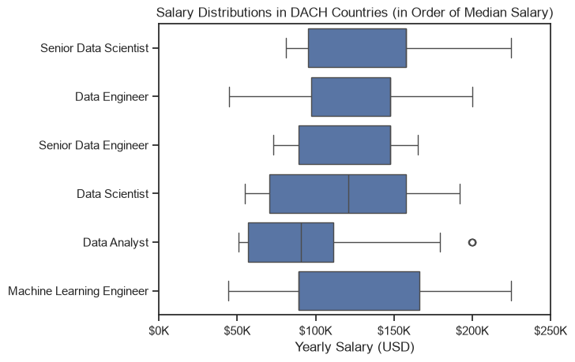

*Annual salary distributions for the six most frequent job titles among DACH postings with reported salary information, ordered by median salary.*

The following table supplements the boxplots with the underlying sample sizes and quartile values:

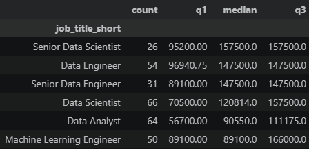

*Count of salary observations, first quartile, median, and third quartile for each displayed job title.*

#### Insights

- **Senior Data Scientists show the highest sample median:** Their median annual salary is **$157,500**, based on **26** salary observations.
- **Data Engineers and Senior Data Engineers share the same median:** Both groups have a median salary of **$147,500**, despite representing different seniority levels. This may partly reflect the limited sample size, repeated salary values, or differences in which employers disclose salaries.
- **Data Scientists occupy the middle of the ranking:** Their median is **$120,814**, based on **66** observations.
- **Data Analysts and Machine Learning Engineers have the lowest medians in this sample:** Their respective medians are **$90,550** and **$89,100**. The Machine Learning Engineer distribution is especially broad, with the median equal to the first quartile and the third quartile reaching **$166,000**.
- **Some median lines appear to be missing:** They are still present but overlap a box boundary. The median equals the third quartile for Senior Data Scientists, Data Engineers, and Senior Data Engineers, while the Machine Learning Engineer median equals the first quartile.
- **The ranking is not fully robust:** The displayed role-level sample sizes range only from **26 to 66** observations. The identical medians for Data Engineers and Senior Data Engineers should therefore not be interpreted as proof that both roles generally offer the same compensation across the DACH market.

#### Updated salary coverage and pooled distribution

The 2025 salary subset alone is too small for meaningful role-level boxplots. Even among its six most represented job titles, the available salary counts range only from one to five observations:

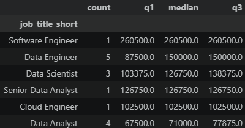

*2025 salary-coverage diagnostic. The small `count` values explain why a standalone 2025 boxplot would be unstable.*

The updated notebook therefore pools every salary-reported DACH posting available in the current export:

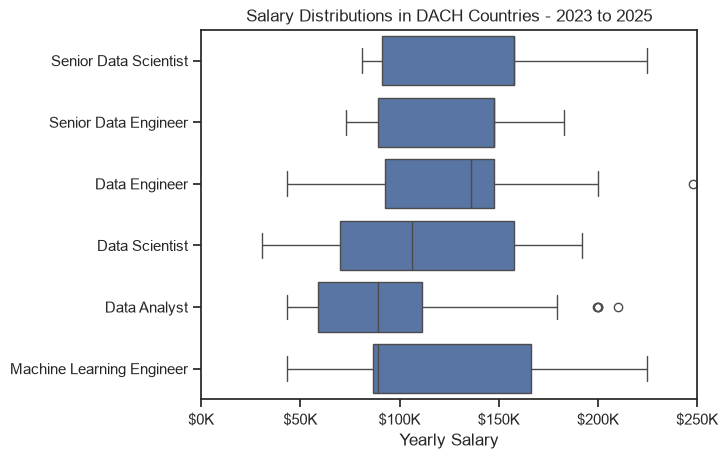

*Pooled DACH salary distributions for the available period from 2023 through November 2025. The revised plot title summarizes this period as `2023 to 2025`.*

The pooled boxplots are based on the following validated summary statistics:

| Job title | Salary observations | Q1 | Median | Q3 |
|---|---:|---:|---:|---:|
| Senior Data Scientist | 31 | $91,350 | $157,500 | $157,500 |
| Senior Data Engineer | 38 | $89,325 | $147,500 | $147,500 |
| Data Engineer | 70 | $92,500 | $135,790 | $147,500 |
| Data Scientist | 93 | $70,000 | $106,500 | $157,500 |
| Data Analyst | 87 | $58,800 | $89,100 | $111,175 |
| Machine Learning Engineer | 65 | $86,400 | $89,100 | $166,000 |

- **Pooling improves the observation base:** The displayed role groups now contain between **31 and 93** salary observations instead of relying on the extremely small 2025-only groups.
- **Senior roles remain at the top of the pooled ranking:** Senior Data Scientists have the highest median at **$157,500**, followed by Senior Data Engineers at **$147,500**.
- **Data Analysts and Machine Learning Engineers share the lowest pooled median:** Both are at **$89,100**, although the Machine Learning Engineer distribution is much wider.
- **The pooled chart is not a temporal comparison:** Because it combines several years, differences from the original 2023 plot cannot be attributed to salary growth or decline. The purpose is to obtain a more stable distribution from the limited salary data.
- **Outliers remain visible:** Data Engineer and Data Analyst postings include individual high-salary observations beyond the upper whiskers.

### 3.2 Median salary of top-paying and frequently requested skills

#### Method

The skill lists from salary-reported postings are expanded into individual rows. Two separate rankings are then created:

1. the ten skills with the highest median salary;
2. the ten most frequently mentioned skills, reordered by their median salary for the visualization.

```python
df_DACH_expl = df_DACH.explode(column="job_skills").copy()

df_DACH_skillsbymedian = (
    df_DACH_expl
    .groupby("job_skills")["salary_year_avg"]
    .agg(["count", "median"])
    .sort_values(by="median", ascending=False)
    .head(10)
)

df_DACH_skillsbyprom = (
    df_DACH_expl
    .groupby("job_skills")["salary_year_avg"]
    .agg(["count", "median"])
    .sort_values(by="count", ascending=False)
    .head(10)
    .sort_values(by="median", ascending=False)
)
```

The `count` value in this section represents skill mentions only within postings that report an annual salary. The calculation therefore does not measure total skill demand across every DACH posting.

Both rankings are plotted on the same salary scale to make their median values directly comparable.

```python
fig, ax = plt.subplots(2, 1)
sns.set_theme(style="ticks")

sns.barplot(
    data=df_DACH_skillsbymedian,
    x="median",
    y=df_DACH_skillsbymedian.index,
    hue="median",
    ax=ax[0],
    palette="dark:b_r"
)

ax[0].legend().remove()
ax[0].set_title("Top 10 Best Paid Skills for Data Jobs in DACH")
ax[0].set_xlabel("")
ax[0].set_ylabel("")
ax[0].set_xlim(0, 250_000)

sns.barplot(
    data=df_DACH_skillsbyprom,
    x="median",
    y=df_DACH_skillsbyprom.index,
    hue="median",
    ax=ax[1],
    palette="dark:b_r"
)

ax[1].legend().remove()
ax[1].set_title("Top 10 Most In-Demand Skills for Data Jobs in DACH")
ax[1].set_xlabel("Median Salary (USD)")
ax[1].set_ylabel("")
ax[1].set_xlim(0, 250_000)

for axis in ax:
    axis.xaxis.set_major_formatter(
        plt.FuncFormatter(lambda x, _: f"${int(x / 1000)}K")
    )

fig.tight_layout()
plt.show()
```

#### Results

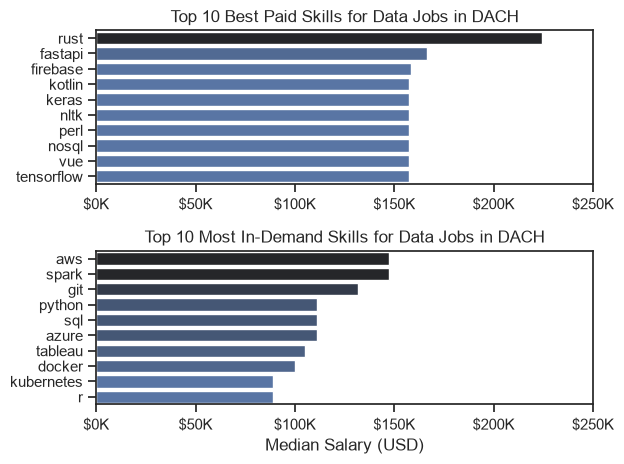

*2023 baseline: comparison between the skills with the highest observed median salaries and the most frequently mentioned skills within the DACH salary subset.*

#### Insights

- **Rust has the highest observed median salary:** It stands clearly above the other skills in the salary-ranked group, while FastAPI follows in second place.
- **Several specialized skills share similarly high medians:** Firebase, Kotlin, Keras, NLTK, Perl, NoSQL, Vue, and TensorFlow cluster around a median salary of approximately **$157,500**.
- **AWS and Spark lead among the frequently mentioned skills:** Both combine comparatively high medians with strong representation in the salary subset. Git follows, while Python, SQL, and Azure form a middle group with similar median salaries.
- **Frequently requested skills produce the more market-relevant comparison:** Their larger number of mentions generally makes them more informative than niche skills that appear at the top of the salary ranking on the basis of very few observations.
- **The highest-paying-skill ranking is particularly sensitive to small samples:** No minimum `count` threshold is applied before selecting the ten highest medians. A skill can therefore enter the ranking because of only a small number of salary-reported postings.
- **These results are descriptive, not causal:** The analysis does not show that learning a particular skill causes a higher salary. Seniority, job title, employer, country, and the limited availability of salary information may all influence the observed medians.

## 4. Which skills offer the best combination of prominence and salary?

View the complete analysis and executable code in the [DACH Optimal Skills notebook](3_Project/5_Optimal_Skills.ipynb).

### Method

The final analysis combines two measures for every skill found in DACH postings with a reported annual salary:

- `skill_perc`: the percentage of salary-reported postings that mention the skill;
- `median_salary`: the median annual salary associated with those postings.

```python
df_DACH = (
    df[df["job_country"].isin(DACH_countries)]
    .dropna(subset=["salary_year_avg"])
    .copy()
)

df_DACH_expl = df_DACH.explode(column="job_skills")

df_DACH_skillset = (
    df_DACH_expl
    .groupby("job_skills")
    .agg(
        skill_count=("job_skills", "count"),
        median_salary=("salary_year_avg", "median")
    )
    .sort_values(by="skill_count", ascending=False)
)

total_job_count = len(df_DACH)

df_DACH_skillset["skill_perc"] = (
    df_DACH_skillset["skill_count"]
    / total_job_count
) * 100
```

Only skills mentioned in at least **8%** of the salary-reported DACH postings are retained. This removes very rare skills from the comparison and reduces the small-sample distortion observed in the unrestricted salary ranking.

```python
skill_prom = 8

df_DACH_skills_filtered = df_DACH_skillset[
    df_DACH_skillset["skill_perc"] >= skill_prom
]
```

The remaining skills are assigned to technology categories—such as programming, libraries, cloud, analyst tools, and other—using the dataset's `job_type_skills` dictionaries. The resulting DataFrame is visualized as a scatter plot.

```python
sns.scatterplot(
    data=df_DACH_techmerge,
    x="skill_perc",
    y="median_salary",
    hue="technology"
)

plt.xlabel("Prominence of Job Postings")
plt.ylabel("Median Yearly Salary")
plt.title("Salary vs. Prominence of Job Postings for Top Skills")

ax.yaxis.set_major_formatter(
    plt.FuncFormatter(lambda x, _: f"${int(x / 1000)}K")
)
ax.xaxis.set_major_formatter(StrMethodFormatter("{x:,.0f}%"))

plt.show()
```

The visualization builds on the techniques practiced in the [Scatterplots exercise notebook](2_Advanced/12_Exercise_Scatterplots.ipynb).

> [!CAUTION]
> **Salary-subset limitation:** Both prominence and median salary are calculated only from DACH postings containing `salary_year_avg`. The 8% threshold improves comparability within that subset but does not make it representative of all DACH job postings.

### Results

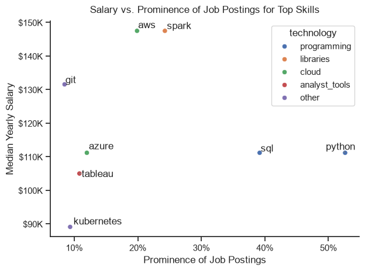

*2023 baseline: median annual salary versus the share of salary-reported DACH job postings mentioning each skill. Only skills reaching the 8% prominence threshold are displayed.*

### Insights

- **Spark and AWS offer the strongest visible balance:** Both are associated with median salaries of roughly **$147,500** while appearing in approximately **24%** and **20%** of the salary-reported postings respectively. They occupy the most attractive upper-right area of the chart.
- **Python and SQL provide the broadest applicability:** Python appears in more than **50%** of the salary subset and SQL in approximately **39%**. Their median salaries are lower than those of Spark and AWS, at roughly **$111,000**, but their much greater prominence makes them foundational skills.
- **Git combines a relatively high salary with lower prominence:** Its median is approximately **$131,000**, but it appears in only around **9%** of the salary-reported postings.
- **Azure and Tableau occupy the middle of the comparison:** Azure reaches about **12%** prominence with a median near **$111,000**, while Tableau is close to **11%** with a median around **$105,000**.
- **Kubernetes has the lowest observed median among the displayed skills:** It passes the prominence threshold but is associated with a median salary of approximately **$89,000** in this subset.
- **“Optimal” is a two-dimensional interpretation:** The notebook does not calculate a single composite score. Skills are evaluated visually by their position on the prominence and median-salary axes, so the preferred skill depends on whether breadth of demand or compensation receives more weight.
- **The findings remain directional:** Salary disclosure is limited, and role seniority, country, employer, and combinations with other skills can influence the observed medians. The chart supports prioritization hypotheses rather than causal conclusions about the salary effect of learning an individual skill.

### 2025 comparison

The updated notebook applies the same calculation to the January–November 2025 DACH subset:

```python
df_2025 = df[df["job_posted_date"].dt.year == 2025]

df_DACH = (
    df_2025[df_2025["job_country"].isin(DACH_countries)]
    .dropna(subset=["salary_year_avg"])
    .copy()
)
```

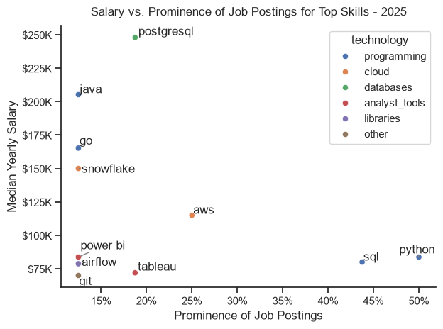

*January–November 2025 comparison using the same 8% prominence threshold within the salary-reported DACH subset.*

> [!CAUTION]
> **Very small 2025 salary sample:** The 2025 role-level diagnostic contains only one to five salary observations per leading job title. In such a small salary subset, an 8% skill threshold can be reached with only a few postings. The unusually high medians for individual skills should therefore be treated as unstable sample results, not as market salary benchmarks.

- **Python and SQL remain the most prominent skills:** Python appears in about **50%** and SQL in approximately **44%** of salary-reported postings. Their associated medians are roughly **$84,000** and **$80,000**, substantially below their positions in the 2023 chart.
- **AWS gains prominence but has a lower observed median:** Its share rises from roughly **20%** to **25%**, while the associated median moves from about **$147,500** in the baseline to approximately **$115,000** in 2025.
- **PostgreSQL occupies the highest point in the 2025 chart:** It appears in roughly **19%** of the salary subset with a median near **$248,000**. Given the small underlying sample, this should be treated as an outlier-sensitive result.
- **Java, Go, and Snowflake form a high-salary, lower-prominence group:** Their observed medians range from approximately **$150,000** to **$205,000**, but each appears in only around **12%** of the salary subset.
- **The technology mix changes:** Spark, Azure, and Kubernetes are no longer present above the threshold, while PostgreSQL, Java, Go, Snowflake, Power BI, and Airflow enter the displayed set.
- **Tableau becomes more prominent but has a lower associated median:** Its share increases to roughly **19%**, while the median is approximately **$72,000**.
- **The two years should be compared directionally:** Differences can reflect the very small 2025 salary sample, changing role composition, employer mix, or salary-reporting patterns—not only changes in the market value of individual skills.

## What I Learned So Far

- **Choosing the correct denominator matters:** Skill demand should be calculated against the number of original job postings, not against the number of rows produced by `explode()`.
- **Exploding list columns enables grouped analysis:** Converting each skill list into individual rows makes it possible to count and compare skill occurrences efficiently.
- **Percentages can overlap:** Since a single posting can request multiple skills, posting-level skill percentages do not need to sum to 100%.
- **Regional filtering changes the analytical context:** Findings for the DACH region should not be copied from a U.S.-focused analysis without recalculation.
- **Clear chart annotations improve readability:** Direct percentage labels make the comparison of skill demand easier across roles.
- **Monthly counts need normalization:** Dividing monthly skill mentions by the number of postings in the same month makes periods with different posting volumes comparable.
- **A fixed skill selection improves trend comparisons:** Selecting the five leading skills by their totals for the respective analysis period keeps the plotted categories consistent across every available month. The 2023 baseline covers twelve months, whereas the 2025 DACH comparison covers January through November.
- **Boxplots and numerical summaries complement each other:** The table of counts and quartiles makes sample size limitations visible and explains why some median lines overlap the box boundaries.
- **Salary rankings need observation thresholds:** A high median based on only a few postings is less reliable than a similar median supported by many salary observations.
- **Missing salary values change the analytical population:** Salary-based role and skill rankings describe only the subset of postings that disclose annual compensation.
- **Dataset coverage must be checked after filtering:** Although the complete global export extends into 2026, the DACH subset ends in November 2025. The maximum date of the source file is therefore not automatically the maximum date of every regional analysis.
- **Comparable periods require explicit definitions:** The new year-specific charts use January through November 2025, while the 2023 baseline contains the full calendar year. December-to-December comparisons are not possible with the current DACH data.
- **Pooling can improve stability but changes the question:** Combining all available DACH salary observations produces more informative boxplots, but it describes the pooled 2023–November 2025 sample rather than a change between individual years.
- **Raw dimensions require semantic checks:** The EDA location field mixes cities, countries, and remote labels, while Boolean columns such as `job_no_degree_mention` must be interpreted according to their exact definitions.
- **Entity resolution changes aggregated results:** Consolidating employer aliases prevents one organization from being split across several company labels.
- **An “optimal” skill depends on the objective and sample:** Python and SQL maximize broad applicability in both comparison periods. Spark and AWS provide the strongest salary-prominence balance in the 2023 baseline, while the apparent 2025 leaders are too dependent on a very small salary sample to support the same level of confidence.

## Challenges

- Ensuring that the percentage denominator represents job postings rather than exploded skill rows.
- Handling postings with missing skill information without treating missing values as actual skills.
- Keeping the same visual scale across subplots while preserving readable labels.
- Separating supported conclusions from contextual fields that are not directly comparable or are poorly suited to the DACH region.
- Distinguishing changes in raw posting volume from changes in the percentage of postings that request a particular skill.
- Distinguishing the global export's maximum date from the effective date coverage of the filtered DACH subset.
- Comparing a complete 2023 calendar year with a 2025 DACH period that ends in November and contains no December observations.
- Placing direct labels at the end of the trend lines without reducing readability or confusing closely positioned series.
- Interpreting salary distributions from relatively small samples without overstating differences between roles.
- Using a pooled 2023–November 2025 salary distribution to improve sample size without presenting it as a direct before-and-after comparison.
- Comparing specialized and frequently requested skills when their salary medians can be based on very different numbers of observations.
- Keeping the distinction clear between overall skill demand and skill frequency within the smaller salary-reported subset.
- Comparing city, country, and remote location labels that coexist in the same source column.
- Interpreting employment-related Boolean flags without reversing their meaning or overstating what an uninformative field can show.
- Balancing prominence and compensation without implying that one skill independently causes a higher salary.

## Conclusion

The exploratory comparison shows both continuity and change between the 2023 baseline and January–November 2025. Berlin remains the leading city-level location, while Zürich becomes more prominent in the updated period. The company ranking changes much more strongly: Deutsche Bahn leads the 2023 data, whereas job boards and recruitment platforms such as beBee Careers, Tideri Jobbörse, and TN Switzerland occupy the leading positions in 2025. Because source coverage and company attribution can affect these rankings, this shift should not be interpreted solely as employer-market turnover. The explicit work-from-home share decreases slightly, while postings without a degree mention become somewhat more common.

Python and SQL remain the most consistently requested skills across roles and periods. The updated role-level results also reveal more specific shifts: Power BI gains importance for Data Analysts, Databricks enters the Data Engineer top five, and TensorFlow replaces AWS among the five leading Data Scientist skills. The monthly 2025 trends are more volatile than the 2023 baseline, with a particularly strong late-period rise for Azure. However, the updated DACH trend ends in November and therefore contains no December observation.

The salary findings require the strongest caution. A standalone 2025 salary analysis is based on too few observations for stable role-level distributions. The updated boxplot therefore pools all available DACH salary observations from 2023 through November 2025. It provides a broader descriptive salary distribution, but it is not evidence of salary growth or decline between 2023 and 2025. The identical or similar role medians and the high observed salaries of some individual skills can be strongly influenced by sparse reporting, repeated salary values, role composition, and outliers.

The salary-versus-prominence analysis identifies Spark and AWS as the strongest visible balance in the 2023 baseline, while Python and SQL remain the broadest foundational choices in both periods. The 2025 chart places PostgreSQL, Java, Go, and Snowflake relatively high on the salary axis, but the underlying salary subset is so small that these positions should be treated as exploratory signals rather than market benchmarks.

Finally, the temporal scope must remain explicit: the complete global export contains records into 2026, but the filtered DACH data ends in **November 2025**. Consequently, none of the updated DACH findings describe 2026, the 2025 comparison is not a complete calendar year, and the pooled salary analysis effectively covers 2023 through November 2025. Within those limitations, the five notebooks provide a reproducible workflow from market orientation and demand trends to salary distributions and skill prioritization while keeping the main data-quality risks visible.
